<p align="center">
  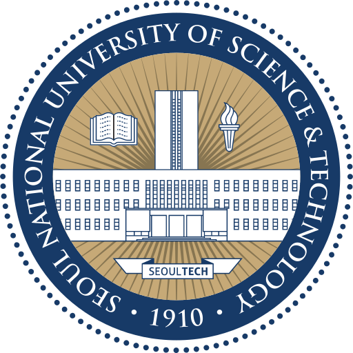
</p>

<h1 align="center">서울과기대 LMS e-Class 커넥터 - win64</h1>

<p align="center">
  <strong>수업 공지와 과제를 일일이 찾지 말고, AI에게 물어보세요.</strong><br>
  서울과학기술대학교 e-Class의 공지·과제·마감일을 Codex와 Claude가 읽을 수 있게 연결하는<br>
  Windows용 읽기 전용 로컬 MCP 커넥터입니다.
</p>

<p align="center">
  <a href="https://github.com/Shine-musC4T/seoultech-lms-connector/releases/latest"><strong>최신 버전 다운로드</strong></a>
  ·
  <a href="#1분-설치-가이드"><strong>설치 가이드</strong></a>
  ·
  <a href="#설치-확인"><strong>설치 확인</strong></a>
</p>

<p align="center">
  📁 <strong>Google Drive가 편하신 분은 <a href="https://drive.google.com/drive/folders/1komzUEuiQ4qwXOIUtkAzj2eYIRSo2USp?usp=drive_link">여기서 다운로드하세요!</a></strong>
</p>

<p align="center">
  
  
  
  
  
</p>

> [!IMPORTANT]
> 서울과학기술대학교 또는 e-Class 운영사가 제작·승인·지원하는 공식 프로그램이 아닌 독립적인 커뮤니티 프로젝트입니다. AI 요약과 파싱 결과에는 오류가 생길 수 있으므로 시험, 과제, 출석, 제출 여부와 마감 시각은 반드시 e-Class 원문에서 최종 확인하세요. 자세한 내용은 [DISCLAIMER.md](DISCLAIMER.md)를 확인하세요.

## 무엇을 할 수 있나요?

```text
“이번 스페인어 테스트 날짜·시간·장소 찾아줘.”
“모든 과목 공지를 확인해서 중간고사 일정만 표로 만들어줘.”
“현재 미제출 과제를 마감이 가까운 순서로 정리해줘.”
“이번 주에 새로 올라온 공지 중 중요한 내용만 요약해줘.”
“7일 안에 마감되는 과제를 과목별로 정리해줘.”
```

공지 제목의 짧은 미리보기만 보는 것이 아니라 **공지 전체 본문**을 조회합니다. 시험 날짜·시간·건물·강의실·범위처럼 본문에만 적힌 정보도 찾을 수 있으며, LMS에서 확인되지 않는 값은 임의로 추측하지 않는 것을 기본 원칙으로 합니다.

| 지원 기능 | 내용 |
| --- | --- |
| 수강 과목 | 현재 정규 수강 과목 조회 |
| 공지 | 과목별·전체 공지, 게시일과 전체 본문 조회 |
| 공지 검색 | 공지 본문에서 시험·준비물·일정 변경 등 검색 |
| 과제 | 과목별·전체 과제, 마감일과 제출 여부 조회 |
| 미제출·마감 | 미제출 과제와 일정 기간 안에 마감되는 과제 조회 |
| AI 연동 | Codex 플러그인, Claude Desktop, Claude Code용 로컬 MCP |

## 실제 동작 미리보기

아래 썸네일을 누르면 YouTube에서 실제 시연 영상이 재생됩니다.

<table>
  <tr>
    <th width="50%">Claude 시연</th>
    <th width="50%">Codex 시연</th>
  </tr>
  <tr>
    <td align="center">
      <a href="https://www.youtube.com/watch?v=r97yNbs5nV0&autoplay=1">
        
      </a>
    </td>
    <td align="center">
      <a href="https://www.youtube.com/watch?v=0DFVmfkOvx4&autoplay=1">
        
      </a>
    </td>
  </tr>
  <tr>
    <td align="center"><a href="https://www.youtube.com/watch?v=r97yNbs5nV0&autoplay=1"><strong>▶ Claude 시연 영상 보기</strong></a></td>
    <td align="center"><a href="https://www.youtube.com/watch?v=0DFVmfkOvx4&autoplay=1"><strong>▶ Codex 시연 영상 보기</strong></a></td>
  </tr>
</table>

## 다른 도구와 연결하면

이 커넥터는 LMS 데이터를 **읽어서 AI에 전달하는 역할만** 합니다. AI의 예약 실행 기능이나 Google Calendar·Outlook 같은 별도 도구를 함께 연결하면 다음처럼 확장할 수 있습니다.

- 매일 아침 새 공지와 임박한 미제출 과제 브리핑 받기
- 마감까지 남은 날짜와 제출 상태를 기준으로 긴급도 분류하기
- 확인된 시험·과제 일정을 개인 캘린더에 등록하기
- 지난 조회 이후 새로 생기거나 변경된 공지만 요약받기
- 모든 과목의 시험 날짜·시간·장소·범위를 한 표로 만들기
- 개인 일정과 시험·과제 마감이 겹치는지 확인하기

> 캘린더 등록이나 예약 실행 기능이 이 저장소에 내장된 것은 아닙니다. 사용 중인 AI에 해당 도구가 별도로 연결되어 있어야 합니다.

## 1분 설치 가이드

### 준비물

- Windows 10 또는 Windows 11
- [Python 3.12](https://www.python.org/downloads/) — 설치할 때 `Add Python to PATH`를 선택하는 것을 권장합니다.
- Codex, Claude Desktop 또는 Claude Code 중 사용할 프로그램

<p align="center">
  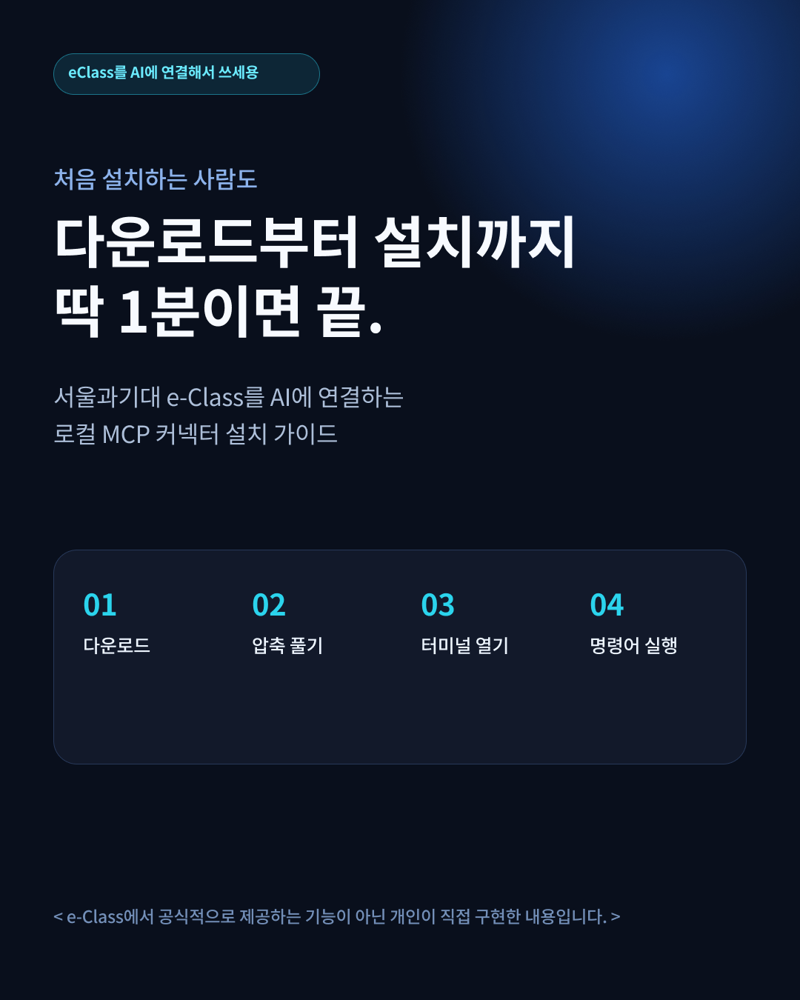
</p>
<details>
<summary><strong>사진으로 설치 과정 전체 보기</strong></summary>

<br>

<p align="center">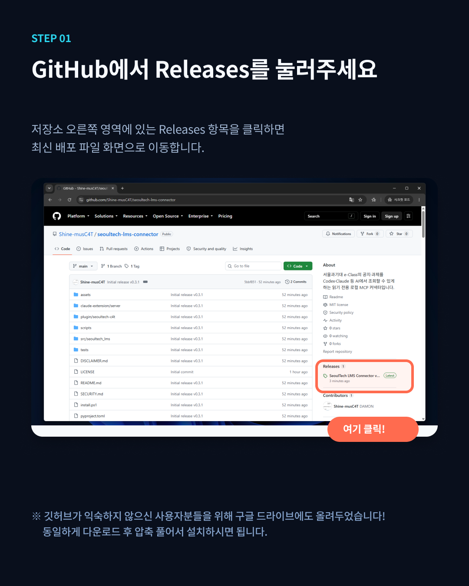</p>
<p align="center">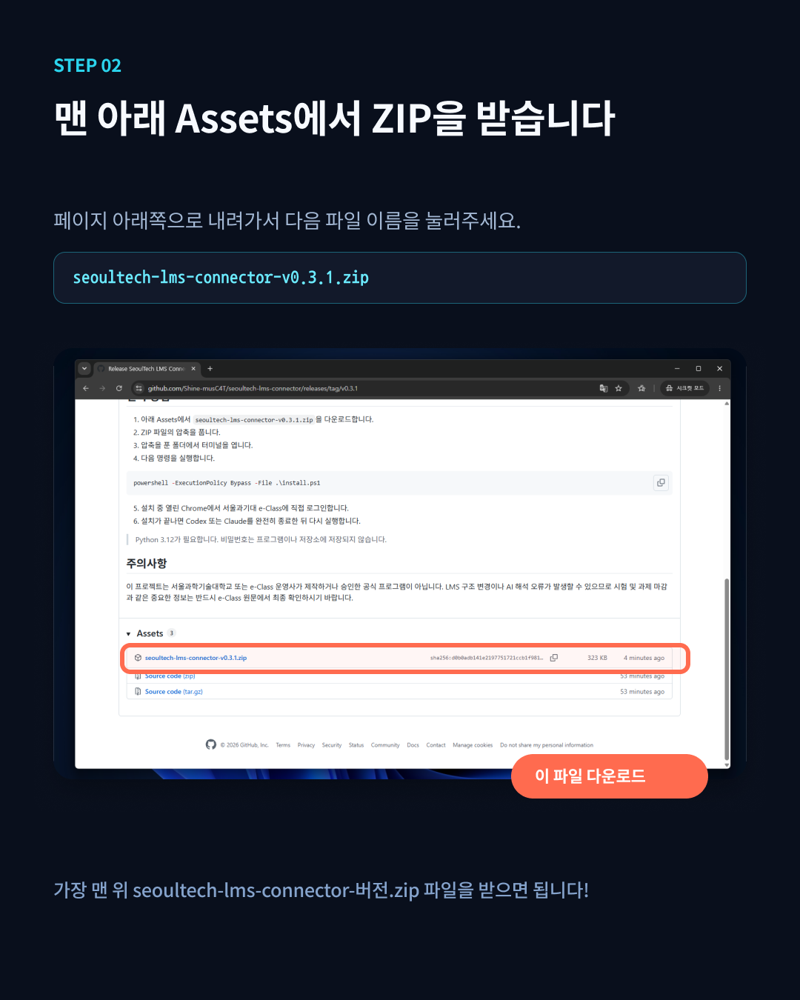</p>
<p align="center">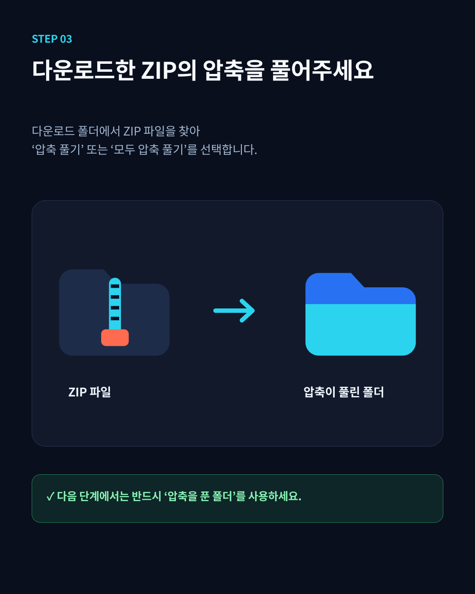</p>
<p align="center">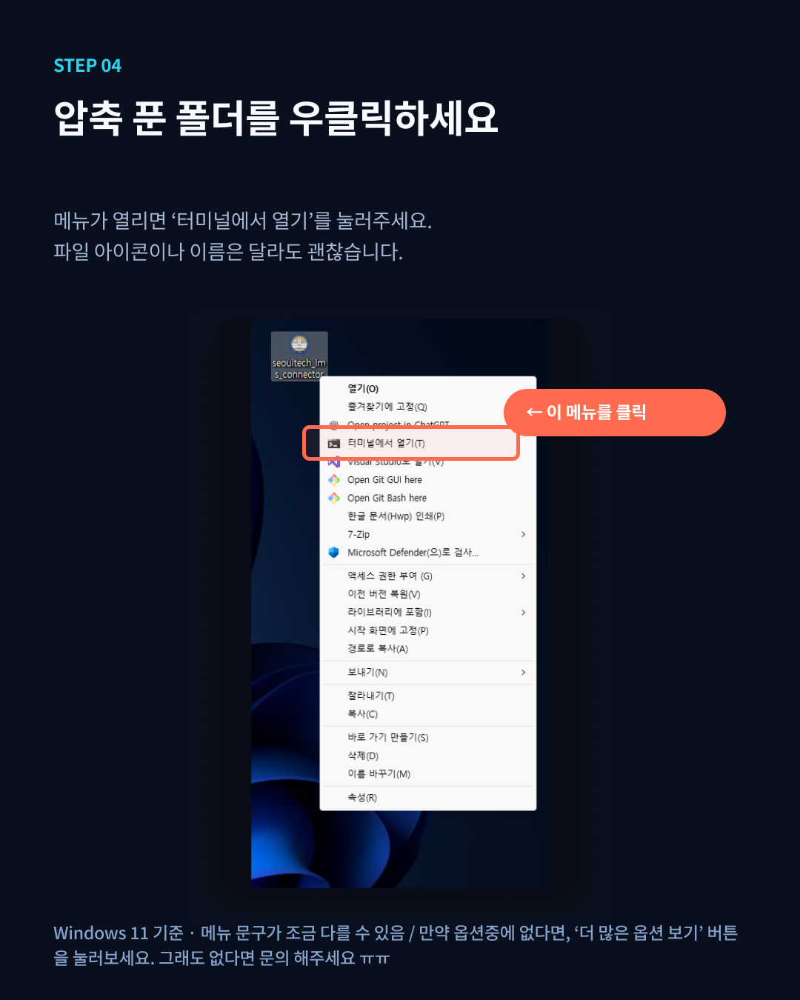</p>
<p align="center">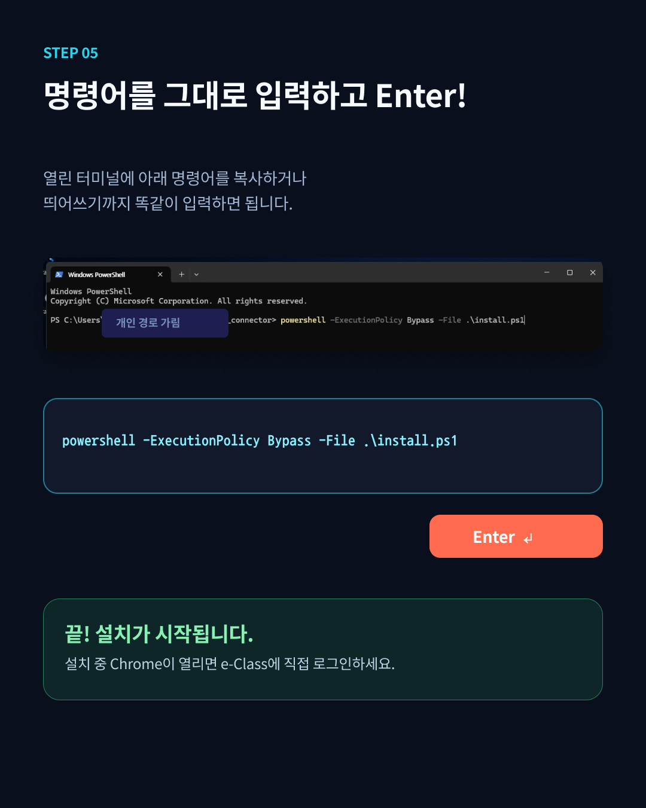</p>

</details>
### 설치 순서

1. [최신 Release](https://github.com/Shine-musC4T/seoultech-lms-connector/releases/latest)의 **Assets**에서 `seoultech-lms-connector-버전.zip`을 다운로드합니다. `Source code`가 아닌 별도로 첨부된 설치용 ZIP을 선택하세요.
2. ZIP 파일의 압축을 풉니다.
3. **압축을 푼 폴더**를 우클릭하고 **터미널에서 열기**를 누릅니다.
4. 아래 명령어를 그대로 입력하고 Enter를 누릅니다.

```powershell
powershell -ExecutionPolicy Bypass -File .\install.ps1
```

5. 설치 중 Chrome이 열리면 서울과기대 e-Class에 직접 로그인합니다.
6. 설치가 끝나면 Codex 또는 Claude를 완전히 종료한 뒤 다시 실행합니다.


설치 명령은 Python 패키지와 의존성을 설치하고, 현재 PC의 Python 경로를 사용해 Codex·Claude 연동을 준비한 뒤 최초 LMS 로그인을 진행합니다. 비밀번호를 스크립트나 터미널에 입력하지 않으며, 사용자가 공식 로그인 페이지에서 직접 로그인합니다.

> [!NOTE]
> Claude Desktop에서 로고와 설명이 표시되는 확장을 사용하려면 설치 스크립트가 안내한 `.mcpb` 파일을 `설정 > 확장 프로그램 > 고급 설정 > 확장 프로그램 설치`에서 직접 선택하고 승인하세요. 기본 MCP 연결은 확장 설치 전에도 유지됩니다.

## 설치 확인

<p align="center">
  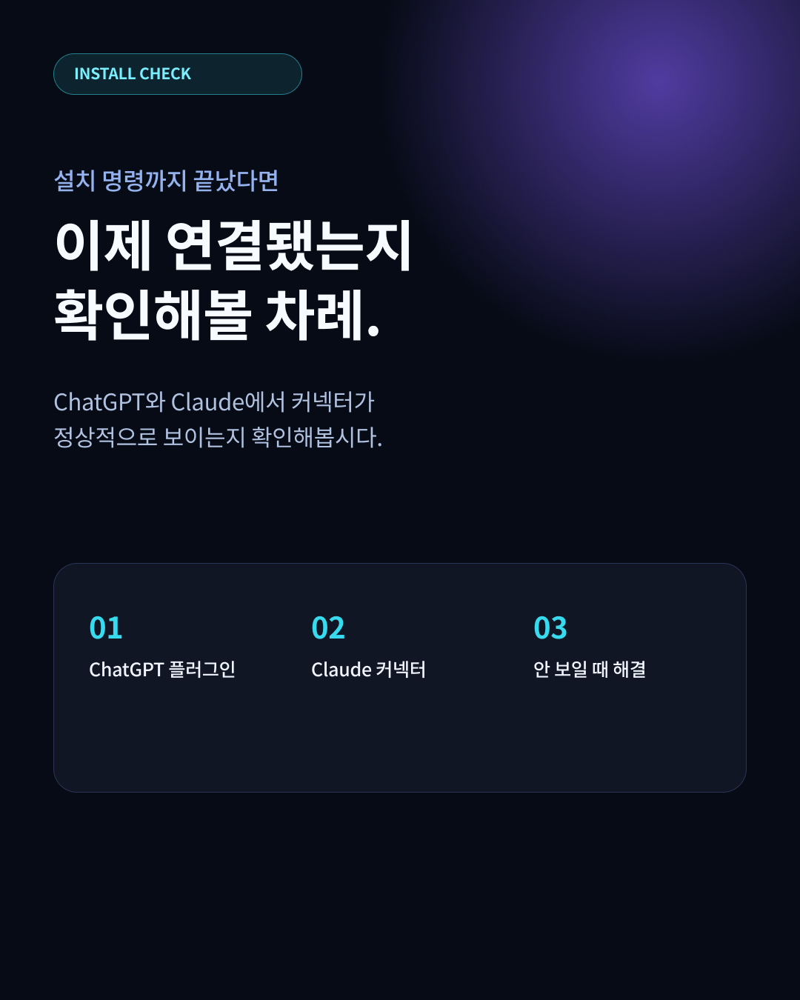
</p>

<details>
<summary><strong>ChatGPT·Claude 설치 확인 방법 보기</strong></summary>

<br>

<p align="center">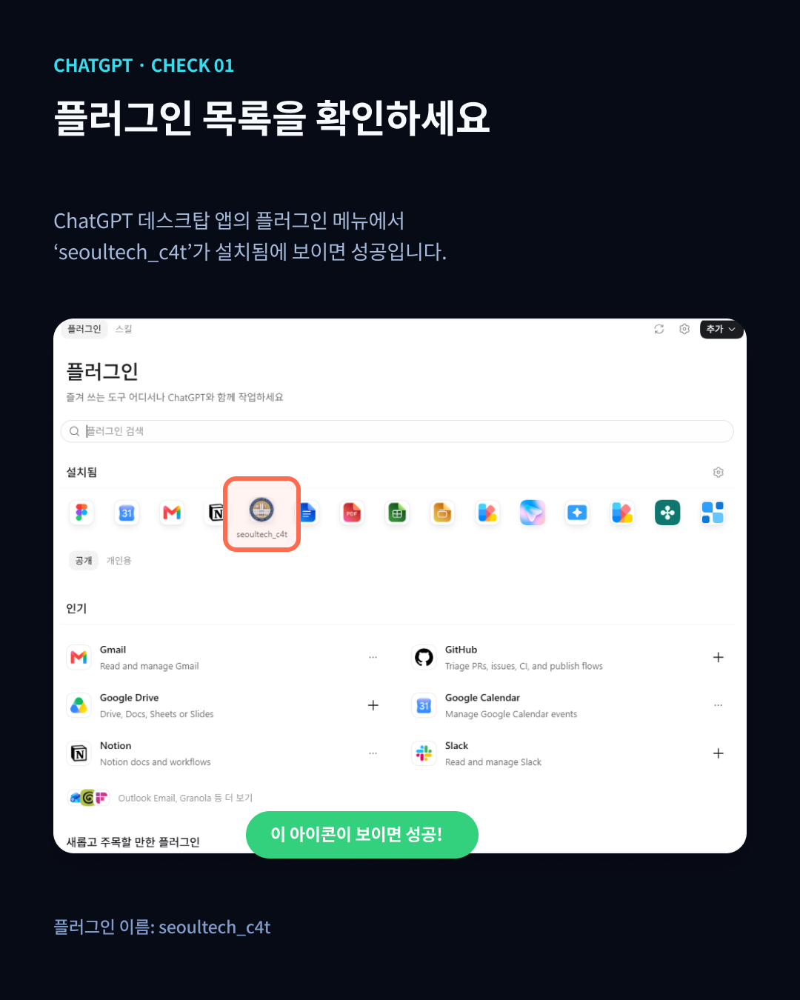</p>
<p align="center">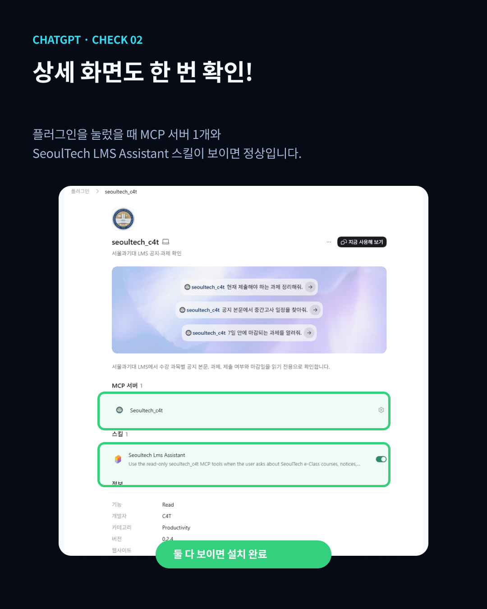</p>
<p align="center">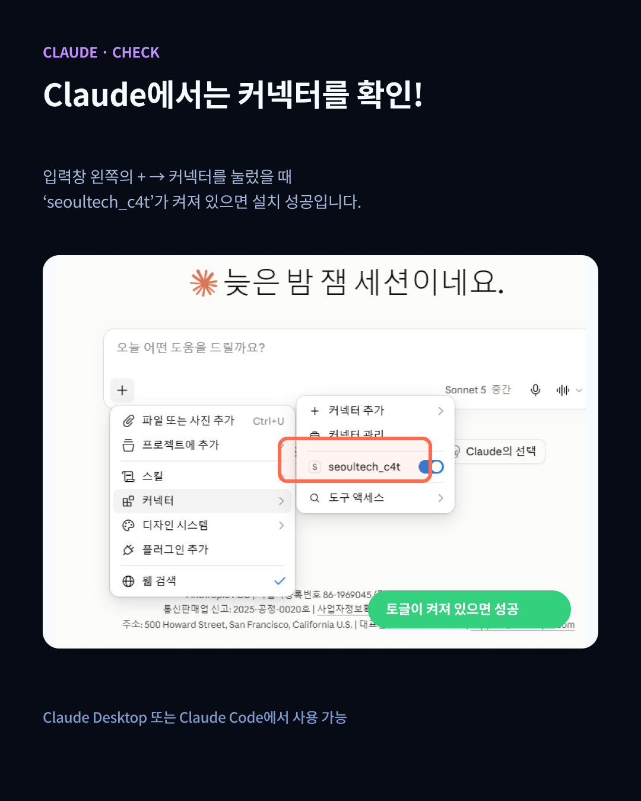</p>
<p align="center">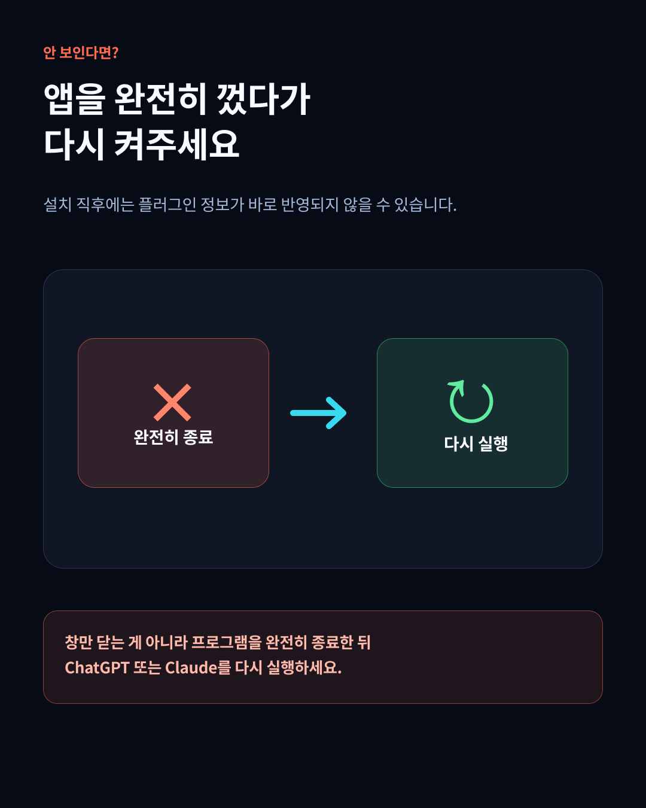</p>
<p align="center">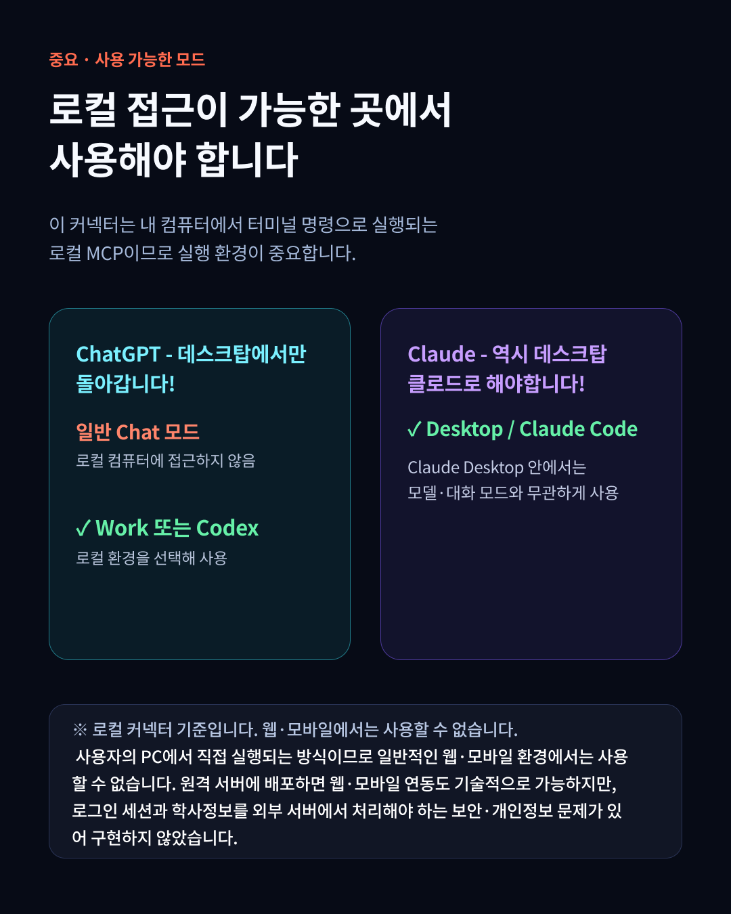</p>
<p align="center">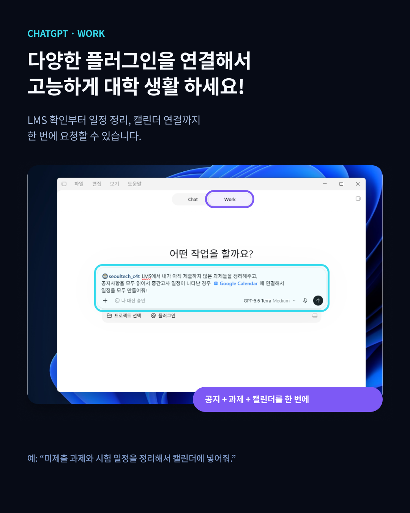</p>

</details>

> 화면 구성과 표시 버전은 앱 및 커넥터 버전에 따라 달라질 수 있습니다. 설치 직후 보이지 않으면 창만 닫지 말고 프로그램을 완전히 종료한 뒤 다시 실행하세요.

### 설치 후 요청 예시

Codex에서는 플러그인을 선택하거나 이름을 붙여 요청할 수 있습니다.

```text
@seoultech_c4t 현재 제출해야 하는 과제 정리해줘.
@seoultech_c4t 7일 안에 마감되는 미제출 과제 알려줘.
@seoultech_c4t 과목별 최근 공지를 요약해줘.
```

Claude Desktop 또는 Claude Code에서는 자연어로 요청하세요.

```text
서울과기대 LMS에서 현재 미제출 과제를 정리해줘.
전체 공지를 확인해서 중간고사 일정을 찾아줘.
7일 안에 마감되는 과제를 알려줘.
```

## 지원 환경

| 환경 | 지원 여부 | 비고 |
| --- | :---: | --- |
| Windows 10/11 | ✅ | 현재 공식 지원 환경 |
| Codex | ✅ | 로컬 플러그인으로 등록 |
| ChatGPT 데스크톱 Work | ✅ | 로컬 도구 실행이 가능한 환경에서 사용 |
| 일반 Chat 모드 | ❌ | 로컬 컴퓨터의 MCP 명령을 실행할 수 없음 |
| Claude Desktop | ✅ | 로컬 MCP 연결 및 선택적 `.mcpb` 확장 |
| Claude Code | ✅ | 사용자 범위 MCP로 등록 |
| 웹·모바일 단독 환경 | ❌ | 로컬 프로세스에 접근할 수 없음 |
| macOS | ⚠️ | 핵심 Python 코드는 이식 가능하지만 설치·연동 미지원 및 미검증 |

> [!NOTE]
> 현재 **로컬 커넥터**만 제공합니다. 원격 서버에 배포하면 웹·모바일 연동도 기술적으로 가능하지만, 로그인 세션과 학사정보를 외부 서버에서 처리해야 하는 보안·개인정보 문제가 있어 구현하지 않았습니다.

## 읽기 전용과 개인정보 보호

- 과제 제출, 파일 업로드, 게시물·댓글 작성, 수정, 삭제 기능을 제공하지 않습니다.
- 조사로 확인된 조회용 endpoint만 allowlist로 허용하며, 그 밖의 요청은 네트워크 전송 전에 차단합니다.
- 공지 상세 열람으로 LMS의 읽음 상태나 조회수가 변경될 수 있습니다.
- 학교 아이디와 비밀번호를 코드, 저장소 또는 `.env`에 저장하지 않습니다.
- 로그인 세션은 사용자 PC의 `%LOCALAPPDATA%\seoultech-lms-connector\auth_state.json`에만 저장됩니다.
- `auth_state.json`은 민감한 파일이므로 다른 사람에게 전달하거나 GitHub에 올리면 안 됩니다.

취약점이나 버그를 제보할 때는 [SECURITY.md](SECURITY.md)의 민감정보 처리 방법을 확인하세요.

## 로그인 세션 갱신

조회 중 세션 만료가 감지되면 AI가 `start_login` 도구를 호출해 로그인용 Chrome 창을 열 수 있습니다. 사용자가 직접 로그인하면 세션이 로컬에 저장되고 창이 자동으로 닫힙니다. 그 뒤 같은 대화에서 원래 요청을 다시 실행하면 됩니다.

터미널에서 직접 갱신하려면:

```powershell
seoultech-lms login
```

## 제거

Codex 플러그인, Claude MCP 설정과 Python 패키지를 제거하려면 압축을 풀었던 배포 폴더에서 실행합니다.

```powershell
.\uninstall.ps1
```

로그인 세션까지 함께 삭제하려면:

```powershell
.\uninstall.ps1 -RemoveAuth
```

Claude Desktop의 `.mcpb` 확장은 Claude의 `설정 > 확장 프로그램`에서 `seoultech_c4t`를 선택해 별도로 제거합니다.

<details>
<summary><strong>CLI와 JSON 출력</strong></summary>

```powershell
seoultech-lms doctor
seoultech-lms courses
seoultech-lms notices
seoultech-lms assignments
seoultech-lms pending
```

AI 에이전트나 다른 프로그램에서는 JSON 출력을 사용할 수 있습니다.

```powershell
seoultech-lms courses --json
seoultech-lms notices --json
seoultech-lms assignments --json
seoultech-lms pending --json
```

</details>

<details>
<summary><strong>설치 옵션과 개발용 명령</strong></summary>

특정 연동이나 최초 로그인을 생략할 때만 사용합니다.

```powershell
.\install.ps1 -SkipCodex
.\install.ps1 -SkipClaude
.\install.ps1 -SkipLogin
```

개발용 설치:

```powershell
py -3.12 -m pip install -e .
```

PC에 Chrome이 없고 Playwright Chromium을 사용해야 할 때:

```powershell
python -m playwright install chromium
```

네트워크 조사와 테스트:

```powershell
python scripts/inspect_network.py --json-only
python -m unittest discover -s tests -v
python scripts/test_connector.py
```

</details>

## 라이선스 및 책임

이 프로젝트는 [MIT License](LICENSE)로 배포됩니다. 프로그램 사용에 따른 최종 책임은 사용자 본인에게 있으며, 자신에게 접근 권한이 있는 계정과 데이터에 대해서만 학교 규정과 관련 법령을 준수해 사용해야 합니다. 전체 고지는 [DISCLAIMER.md](DISCLAIMER.md)를 확인하세요.
